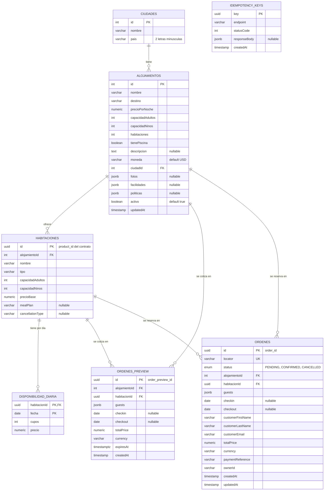

# Modelo de datos — Alojamientos

Modelo mínimo para el flujo de venta: **buscar, ver, reservar y cancelar**, basado en
`contracts/alojamientos-openapi.yaml`. Las entidades están en
`src/modules/alojamientos/entities/`.

## Diagrama



`IDEMPOTENCY_KEYS` no tiene relaciones: es una tabla de apoyo independiente.

## Las 7 tablas

| Tabla | Para qué sirve |
|---|---|
| `ciudades` | Catálogo de ciudades. El contrato filtra por `city` (entero) y `country` (2 letras minúsculas). |
| `alojamientos` | El hotel o lugar donde se hospeda el cliente. Su `id` es **entero**, como pide el contrato (`accommodation: integer`). Guarda los datos que devuelven `/search` y `/details` (descripción, fotos, facilidades, políticas) y `updatedAt`, que servirá para `/details/changes`. |
| `habitaciones` | Cada tipo de habitación de un alojamiento. Es el *product* del contrato: su `id` (UUID) viaja como `product_id`, que en el contrato es **texto**. |
| `disponibilidad_diaria` | Una fila por habitación y por día, con los cupos que quedan y el precio de ese día. La clave primaria es `(habitacionId, fecha)`. De aquí salen `/availability` y el precio total de una estadía. |
| `ordenes_preview` | Cotización guardada antes de reservar. Su `id` es el `order_preview_id`, y `expiresAt` dice hasta cuándo se puede usar para crear la orden. |
| `ordenes` | La reserva. Su `id` (UUID) es el `order_id`, `locator` es el código de confirmación y `status` es `PENDING`, `CONFIRMED` o `CANCELLED`. Guarda los datos del cliente y `ownerId`, que sale del JWT. |
| `idempotency_keys` | Guarda la respuesta de cada `Idempotency-Key`. Si el cliente reintenta con la misma clave, se devuelve lo mismo en lugar de crear otra reserva. |

## Decisiones

- **IDs:** alojamiento y ciudad usan entero autoincremental (el contrato los define como `integer`). Habitaciones, previews y órdenes usan UUID.
- **Fechas:** `checkin`, `checkout` y `fecha` son tipo `date` (sin hora). `expiresAt` lleva zona horaria.
- **Dinero:** columnas `numeric(10,2)` con `ColumnNumericTransformer`, para recibir números y no texto.
- **Lo que queda fuera por ahora:** pagos, huéspedes como tabla aparte, reseñas, webhooks y cadenas hoteleras. Los datos del cliente van dentro de `ordenes`.
- **Borrado:** al borrar un alojamiento se borran sus habitaciones, y al borrar una habitación su disponibilidad (`ON DELETE CASCADE`). Las órdenes no se borran en cascada.

## Datos de prueba (seed)

```bash
npm run seed
```

Carga 3 ciudades, 5 alojamientos, 12 habitaciones y 60 días de disponibilidad por habitación (720 filas). Se puede ejecutar varias veces: no duplica datos y solo agrega los días nuevos que falten. Necesita la base de datos corriendo (`docker-compose up -d`).
